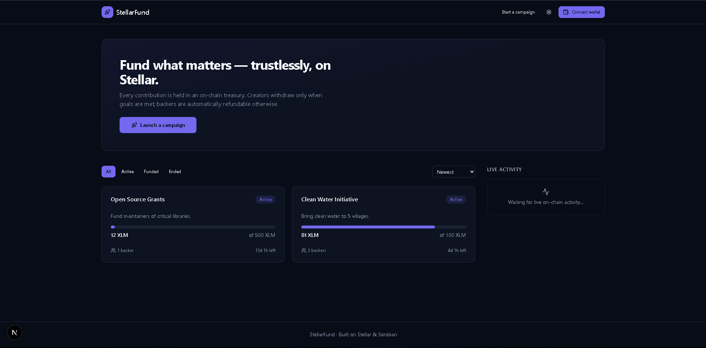
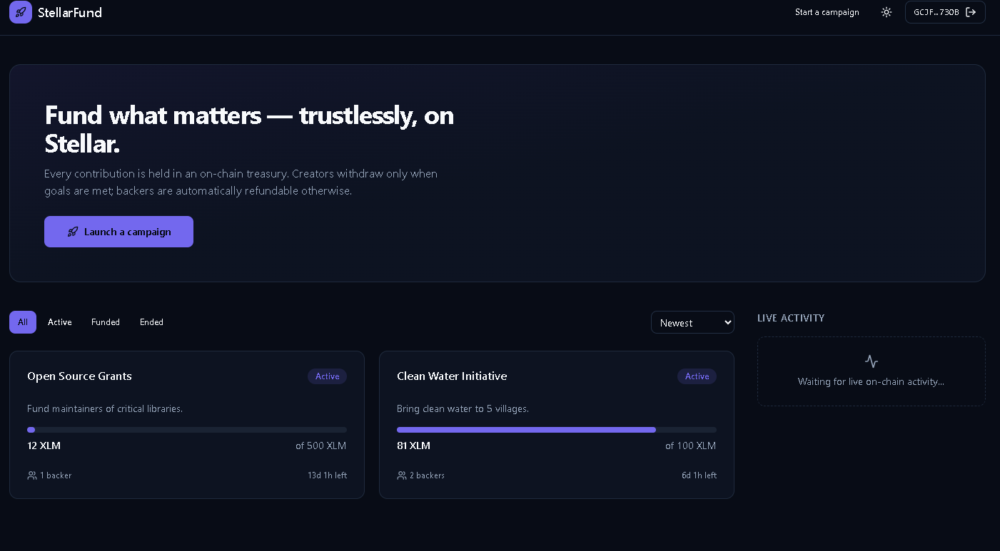
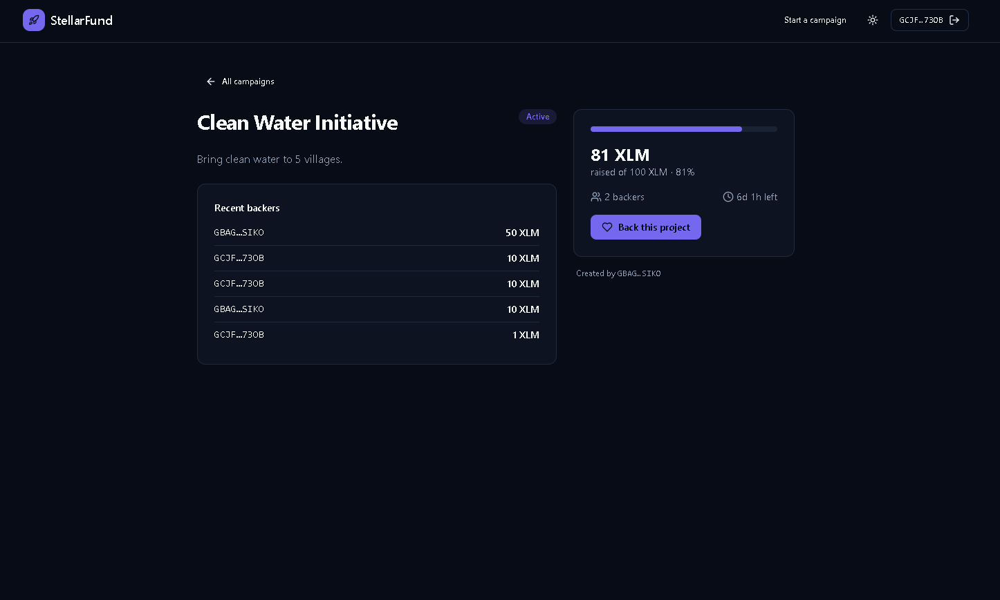
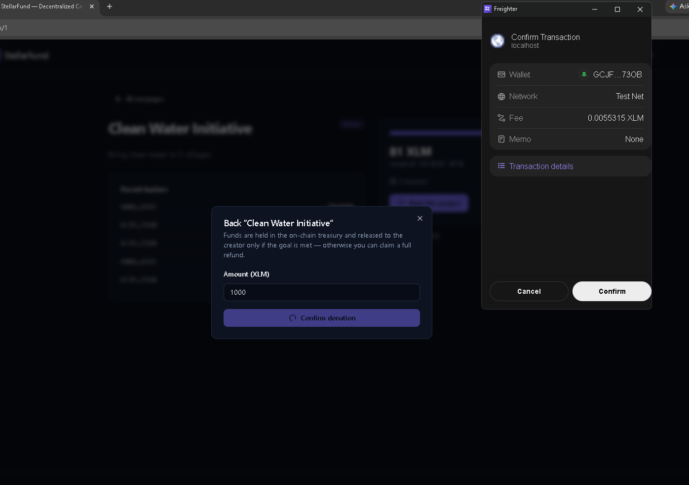

# StellarFund

> Decentralized crowdfunding on the Stellar network — trustless custody, automatic refunds, and full on-chain transparency, powered by Soroban smart contracts.

StellarFund lets anyone launch a crowdfunding campaign and lets backers donate with confidence: funds are held by an on-chain treasury, released to the creator only when the goal is met, and automatically refundable to donors if the campaign fails. No intermediary ever custodies the money.

**🔗 Live demo:** [stellar-dapp-orcin.vercel.app](https://stellar-dapp-orcin.vercel.app/) · **▶️ Video walkthrough:** [youtu.be/pb6IthOQTY8](https://youtu.be/pb6IthOQTY8)

---

## Table of Contents

- [Live Demo](#live-demo)
- [Screenshots](#screenshots)
- [Architecture](#architecture)
- [Deployed Contracts (Testnet)](#deployed-contracts-testnet)
- [How It Works](#how-it-works)
- [Tech Stack](#tech-stack)
- [Getting Started](#getting-started)
- [Smart Contract API](#smart-contract-api)
- [Scripts](#scripts)
- [Testing](#testing)
- [License](#license)

---

## Live Demo

- **Live app:** [stellar-dapp-orcin.vercel.app](https://stellar-dapp-orcin.vercel.app/)
- **Video walkthrough:** [youtu.be/pb6IthOQTY8](https://youtu.be/pb6IthOQTY8)

---

## Screenshots

| Home / Campaign list | Create campaign |
| --- | --- |
|  |  |

| Campaign detail | Donate (Freighter) |
| --- | --- |
|  |  |

To capture them: run the frontend (`npm run dev` in `frontend/`), open `http://localhost:3000`, and save screenshots into `docs/screenshots/`.

---

## Architecture

StellarFund is a monorepo of four Soroban contracts plus a Next.js frontend. Custody is deliberately isolated from business logic — the campaign contract never holds tokens, it orchestrates the treasury.

```
┌──────────┐   create    ┌──────────┐   register   ┌──────────┐
│ Frontend │ ──────────▶ │ Factory  │ ───────────▶ │ Campaign │  (source of truth)
└──────────┘             └──────────┘              └────┬─────┘
      │                        │                        │ deposit / release / refund
      │  donate / withdraw     │  list / index          ▼
      └────────────────────────┴──────────────────▶ ┌──────────┐
                                                     │ Treasury │  (custody of funds)
                                                     └──────────┘
```

- **`factory`** — public entry point and on-chain registry. Creates campaigns and provides paginated discovery (id ↔ creator index).
- **`campaign`** — source of truth for campaign state and business logic (donations, withdrawals, refunds, close).
- **`treasury`** — the only contract that custodies tokens; moves value on authorized calls from the campaign contract.
- **`shared`** — common types, errors, and constants (limits below).

**Protocol limits** (from `contracts/shared`):

| Constant | Value |
| --- | --- |
| Minimum donation | `0.1 XLM` |
| Minimum goal | `1 XLM` |
| Minimum duration | `1 hour` |
| Maximum duration | `180 days` |

---

## Deployed Contracts (Testnet)

Live deployment on the Stellar **testnet** (`deployments/testnet.json`):

| Entity | Address / Hash |
| --- | --- |
| **Admin wallet** | `GBAGGEVTX664L75SAF3VWNQIIIEIJB57PW3RHKDDME2MFDUQJWGSSIKO` |
| **Token (native XLM SAC)** | `CDLZFC3SYJYDZT7K67VZ75HPJVIEUVNIXF47ZG2FB2RMQQVU2HHGCYSC` |
| **Factory contract** | `CA6KEZJLVD6SDS74WWNUVBFT4BV2WOQTVAUM6LEKNJJZV6DYC5YF2ZBN` |
| **Campaign contract** | `CAYFYFZXUITAKSMLUF2F3MJVCVLYCTZYLBXUHHH7M43RBKYKRN7N4FMI` |
| **Treasury contract** | `CCQPTAHIGSYQF4ISDEQ5Y5FIKBTKPIEAZN7QA7VYCN2L6PEIVRYBQXN5` |

Network passphrase: `Test SDF Network ; September 2015` · RPC: `https://soroban-testnet.stellar.org`

---

## How It Works

1. **Create** — a creator calls the factory to create a campaign with a goal and deadline. The factory registers it in the campaign contract and indexes it.
2. **Donate** — backers donate XLM; funds flow into the treasury, credited to that campaign. Each donor's cumulative contribution is tracked for refunds.
3. **Succeed** — if the goal is met by the deadline, the creator withdraws; the treasury releases funds to them.
4. **Fail** — if the goal is not met, donors call refund and the treasury returns their contribution. No funds are ever stranded or held by a middleman.

---

## Tech Stack

- **Smart contracts:** Rust + [Soroban SDK](https://soroban.stellar.org/) `26.1.0` (`no_std`, `wasm32`)
- **Frontend:** Next.js 16 (App Router), React 19, TypeScript
- **Styling/UI:** Tailwind CSS, Radix UI, framer-motion, lucide-react
- **Stellar:** `@stellar/stellar-sdk`, Freighter wallet (`@stellar/freighter-api`)
- **Data:** TanStack Query · **Forms:** react-hook-form + zod · **Charts:** Recharts
- **Testing:** Vitest + Testing Library (frontend), `cargo test` (contracts)

---

## Getting Started

### Prerequisites

- [Rust](https://rustup.rs/) with the `wasm32v1-none` target (see `rust-toolchain.toml`)
- [Stellar CLI](https://developers.stellar.org/docs/tools/developer-tools/cli) (`stellar`)
- Node.js 20+ and npm
- [Freighter](https://www.freighter.app/) browser extension (for the wallet flow)

### 1. Build & deploy contracts

```bash
# Build all contracts to optimized wasm
./scripts/build.sh

# Deploy to testnet — writes deployments/testnet.json and frontend/.env.local
./scripts/deploy.sh

# (optional) seed demo campaigns
./scripts/seed.sh
```

### 2. Run the frontend

```bash
cd frontend
cp ../.env.example .env.local   # if deploy.sh didn't already generate it
npm install
npm run dev
```

Open [http://localhost:3000](http://localhost:3000) and connect Freighter.

---

## Smart Contract API

### Factory
| Method | Description |
| --- | --- |
| `initialize(admin, campaign, treasury)` | Wire the factory to its campaign + treasury contracts. |
| `create_campaign(...)` | Create a campaign (delegates to `Campaign::register`). |
| `list_campaigns()` / `list_paged(start, limit)` | Enumerate campaign ids. |
| `campaigns_by(creator)` | Ids created by an address. |
| `count()` | Total campaigns. |

### Campaign
| Method | Description |
| --- | --- |
| `register(...)` | Create a campaign record (factory-only). |
| `donate(campaign_id, donor, amount)` | Donate; deposits into treasury. |
| `withdraw(campaign_id)` | Creator withdraws when goal met. |
| `refund(campaign_id, donor)` | Refund a donor when campaign fails. |
| `close(campaign_id)` | Close a campaign. |
| `get_campaign` / `get_donations` / `get_contribution` / `total_campaigns` | Read state. |

### Treasury
| Method | Description |
| --- | --- |
| `initialize(...)` / `set_authorized(authorized)` | Setup + authorize the campaign contract. |
| `deposit(campaign_id, from, amount)` | Credit a donation. |
| `release(campaign_id, to)` | Release funds to the creator. |
| `refund(campaign_id, to, amount)` | Return funds to a donor. |
| `get_balance(campaign_id)` / `get_config()` | Read state. |

---

## Scripts

| Script | Purpose |
| --- | --- |
| `scripts/build.sh` | Build all contracts to optimized wasm. |
| `scripts/deploy.sh` | Deploy to testnet, write `deployments/testnet.json` and `frontend/.env.local`. |
| `scripts/seed.sh` | Create demo campaigns on the deployed contracts. |

---

## Testing

```bash
# Contracts
cargo test

# Frontend
cd frontend
npm test
npm run typecheck
```

---

## License

MIT — see [LICENSE](LICENSE).
